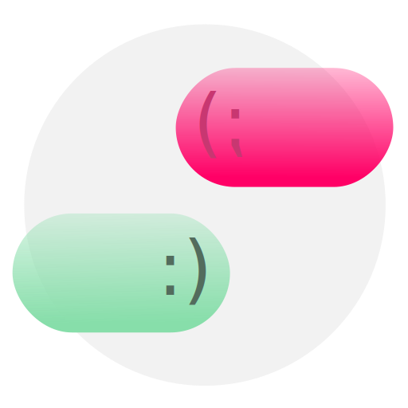
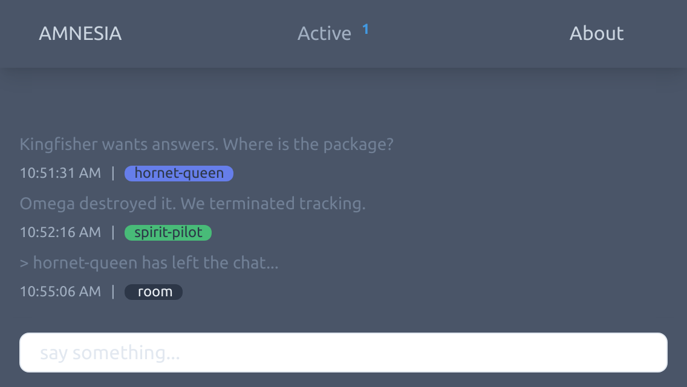

<div id="top"></div>

<!-- PROJECT LOGO -->
<br />

<div align="center">
  

  <h3 align="center"><strong>AMNESIA</strong></h3>

  <p align="center">
    A forgetful chat room with no long term memory.
  </p>
</div>

</br>

# __Amnesia Chat__

## __Summary__
__AMNESIA__ is a simple, anonymous chatroom with no history or logs made as a Web Development exercise.

</br>

<div align="center">
  
</div>

</br>

### __Motivation__

Amnesia is a fun project I put together during the start of the [Covid-19 Pandemic](https://en.wikipedia.org/wiki/COVID-19_pandemic_in_Namibia). I wanted to learn JavaScript to strengthen my web development knowledge while my city was in lockdown.

### __Features__

My first thought while brainstorming this app was to allow anonymous users to enter and chat in a text only environment with basic auto-moderation to keep some semblance of order. I gave myself a few target features focus on so that I stay within scope. Everything wishlisted can be implemented at some time in the future if I ever turn back to this project to work on new skills.

__Priority__

- [x] Clean, minimal user interface that drops the user right into the chat.
- [x] Randomly generated and assigned usernames on every connection to the server.
- [x] Server-side announcements and updates to the room about connected users.
- [x] Activity counter that displays the number of active users in the room.
- [x] Connection limit to prevent room being flooded by new users.
- [x] Reassign usernames on reconnect.

__Wishlist__

- Automated Moderation
  - [ ] word filters
  - [ ] ip block list
  - [ ] link whitelist
  - [ ] flood detection
  - [ ] moderator whitelist
- Bot implementation
  - [ ] Simple commands (!command token)
- UI/UX improvements
  - [ ] Scrolling
  - [ ] Dark mode toggle
  - [ ] UI Scale Options

---

## __Getting Started__

Setting up the service to run is straightforward and requires minimal noodling.  If you want to test this locally you will need to have `GIT`, `NPM`, and `Node.js` installed. The most painless way is by installing [NVM](https://github.com/nvm-sh/nvm).

### __Testing Locally__

```bash
# clone this repository to your machine
git clone https://github.com/m-spangenberg/chat-app.git
# change directory into the cloned repo
cd chat-app
# install all the dependencies listed in package.json
npm install
# run the app with node!
node index.js
```

<sub>If you're stuck, see Heroku's [helpful guide](https://devcenter.heroku.com/articles/deploying-nodejs) on Node.js deployment.</sub>

---

## __Conclusions__

### __Take Away__

To put together this 'forgetful' little chat room, I got my hands dirty learning the basics of HTML and CSS for the frontend and had a rather unexpected deep dive into the inner workings of WebSockets for the backend. Besides the tooling and frameworks involved, I learned quite a bit about SaaS, development workflows and application deployment, specifically the security best practices involved in deploying hosted services. This is my first ever project using `JavaScript, Node.js, Express.js, Pug.js` or `Socket.io`.

### __License__

This project is licensed under the `MIT License` - see the [LICENSE](LICENSE.md) file for details.

### __Acknowledgments__

This app wouldn't be possible without all the amazing work done by open source developers. The front was put together with [Tailwind CSS](https://tailwindcss.com/) and the backend uses [Node.js](https://nodejs.org/), [Express.js](https://expressjs.com/), [Pug.js](https://pugjs.org/), and [Socket.io](https://socket.io/).